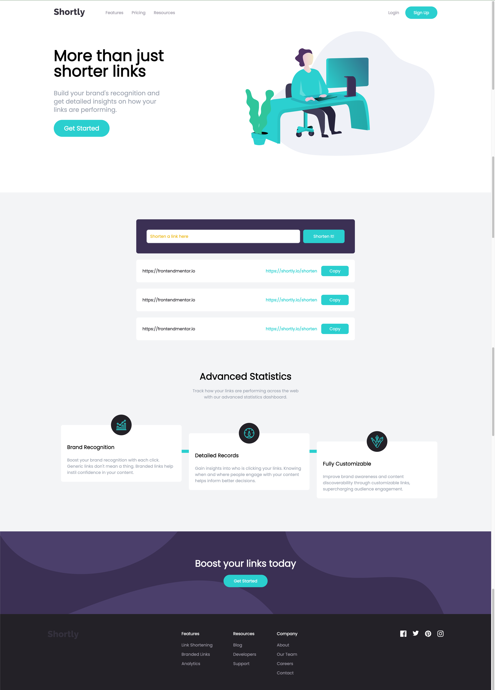

# Shortly - URL Shortening Service

## Project Overview

This project is a simple, responsive webpage for a URL shortening service called **Shortly**. It allows users to shorten long URLs, copy the shortened versions, and track the performance of the shortened links. The page also provides detailed statistics about the performance of these links.

Note: It's just a webpage. The shortened links are not functional and do not redirect to the original URLs.

## Features

- **Responsive Design**: The page is fully responsive, adapting to various screen sizes.
- **Link Shortening**: Users can input a URL, which is then shortened and displayed on the page.
- **Copy to Clipboard**: A convenient "Copy" button to easily copy the shortened link.

## Tech Stack

- **HTML5**: Structure of the webpage.
- **CSS3**: Styling, including a mobile-first layout and responsive design.
- **JavaScript**: Adds interactivity to the page, such as link shortening and copying functionality.
- **Google Fonts**: Fonts used for styling the text.
- **Tailwind CSS**: Utility-first CSS framework used to style the page.

## Getting Started

### Prerequisites

To run this project locally, ensure you have the following installed:

- A modern web browser
- Optionally, a code editor like [VSCode](https://code.visualstudio.com/)

### Running the Project

1. Clone the repository to your local machine:

   ```bash
   git clone https://github.com/penn201500/shortly
   ```

2. Open `index.html` in your browser to view the site.

## Screenshots



## Live Demo

You can view a live demo of this project [here](https://shortly-xi-gold.vercel.app/).

## Contributing

If you'd like to contribute, feel free to open a pull request or create an issue.

## License

This project is licensed under the MIT License.
